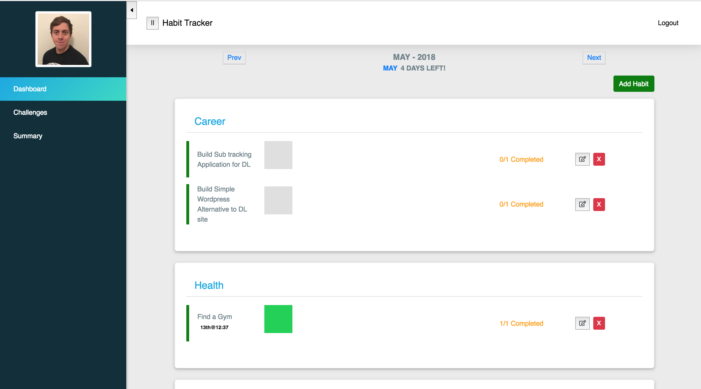
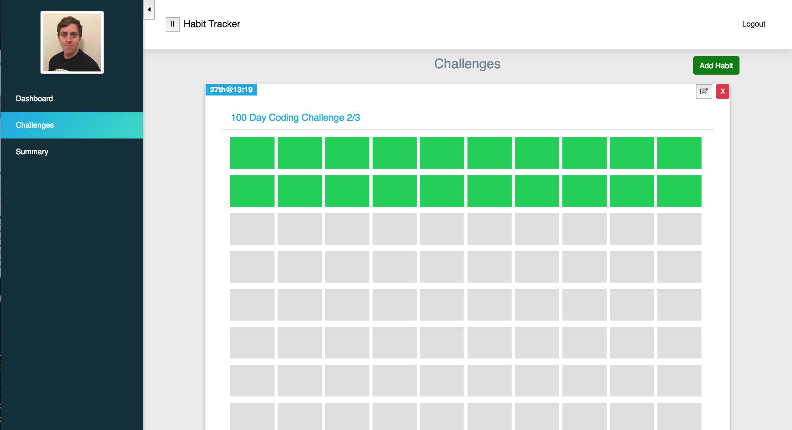

# Habit Tracker / Goal Tracker
Keeping Track of your Habits and Goals easily, quickly and see how you are progressing.
Tracking Regular Habits/Goals

Tracking Challenge Habits/Goals

I am really into habit trackers and I am currently using various tools to track different parts of my life.

- Momentium iphone app - which is common habit tracking technique called "a don't break the streak"

- Goal Tracker - I use Evernote to track my monthly goals and yearly goals. 

I want a easy way to coorlate my tracking into one simple to use interface. Also the advantage of building my own tool I can add features or change it to whatever I like.

## Setup
This application comes in two parts and both can be deployed independently of each other. Altough, its probably best to deploy both on the same server. The technology stack is as follows:
* Front-end
    * React
    * Bootstrap v4
    * Font-awesome for icons

* Back-end
    * NodeJS 
        * ExpressJS
        * PassportJS for login, registration and OAuth
    * DB
        * Mongodb 

### Deployment
As stated earlier this project is divided into two, front-end and back-end and because of that both will need to be started if you want to work on the development.

#### Local Deployment/Deployment

Starting the back-end
1. Once the repo is cloned run `cd personal-habit-tracker`
2. Install the dependencies via running: `npm install`
3. Start the backend via running: `npm start`

Starting the Front-end
1. `cd personal-Habit-tracker-dashboard`
2. Install the dependencies via running: `npm install`
3. Start the backend via running: `npm start`
